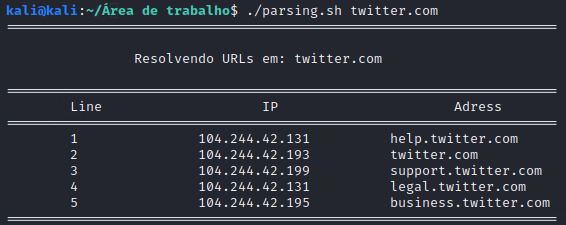

# ParsingHTML

Esse script faz uma varredura por todo o conteúdo HTML de um site, reconhece todas as URLs presentes nesse HTML e retorna o endereço IP de todas essas URLs

## Modo de uso

  ./ParsingHTML.sh [URL SITE]
  
### Exemplo

